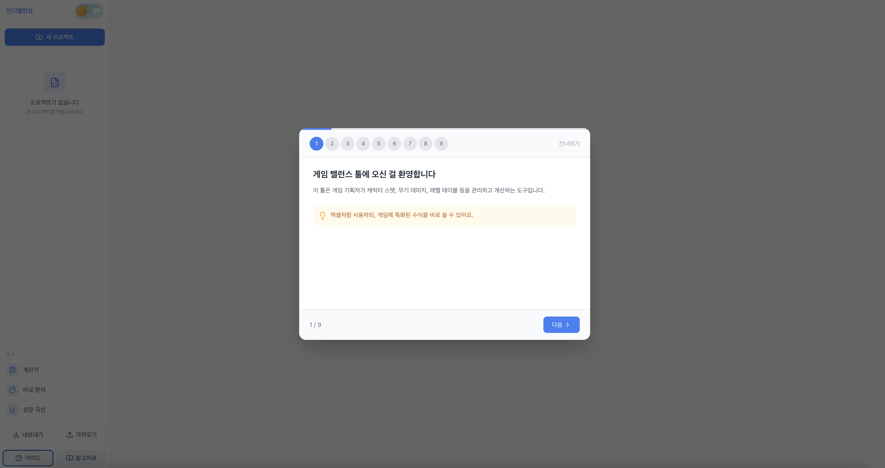
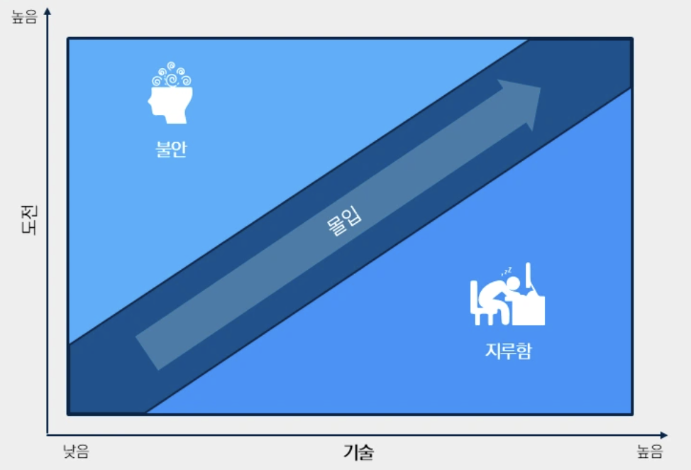
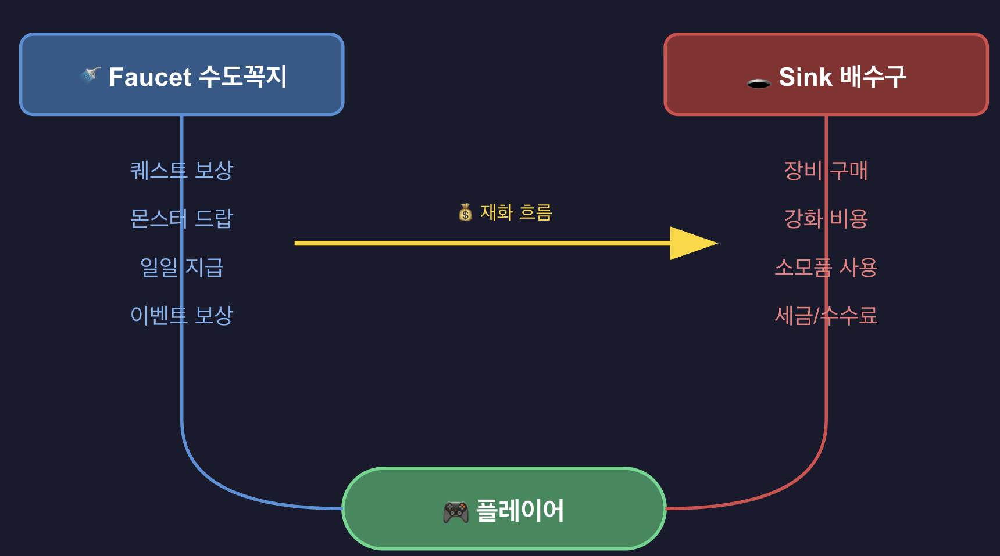
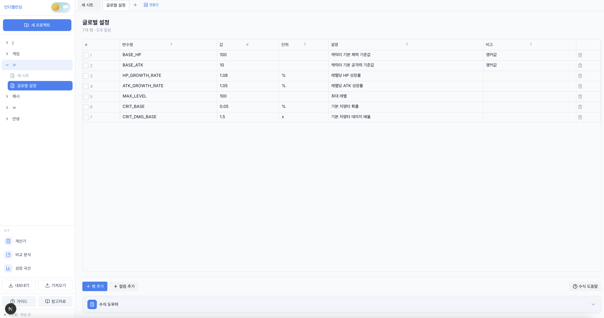
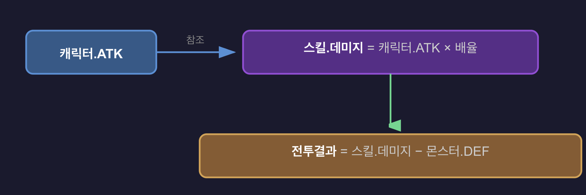

# PowerBalance - Game Balance Tool for Indie Developers



**Live Demo**: https://indiebalancing.vercel.app/

## Overview

**PowerBalance** is a web-based game balance data management tool for indie game developers.

It provides a sheet system and formulas specialized for game development, beyond what Excel offers.

> Local storage based. Works directly in the browser without a server.

---

## Problem Recognition

### Ideal State (Expected Situation)

When managing balance data (character stats, weapon values, level tables, etc.) during indie game development:
- Game-specific formulas (damage formulas, growth curves) should be easy to apply
- Data should automatically sync between sheets (DPS auto-recalculates when weapon stats change)
- Balance state should be visualizable with charts
- Should be able to export directly to JSON for game engines

### Common Needs in Game Balancing

| Need | Description |
|------|-------------|
| Game Formulas | Want to easily apply formulas like DAMAGE, SCALE, TTK |
| Sheet Linking | Related data should auto-recalculate when character stats change |
| Visualization | Want to quickly check growth curves, stat comparisons in charts |
| JSON Export | Extract data in a format directly usable by game engines |
| Clean UI | Frequently used tools should look good for better productivity |

### Research & Learning

**Where I studied:**
- GDC Vault: Practical balancing methodologies (Zynga's formula-driven approach, Slay the Spire data-driven balancing)
- NDC 2018: Nexon's balance planning process
- Academic materials: Csikszentmihalyi's Flow theory, Faucet/Sink model in game economics
- Game dev blogs: TTK/DPS calculation formulas, RPG growth curve design

**What I learned:**
- Balance data should be managed in a "Set standards → Formalize → Visualize → Verify" cycle
- Common formulas exist across games (damage reduction rate, growth curves, TTK)
- Tools used frequently by designers should look good for better productivity

### Solution

**How I solved it:**

1. **Implemented 70+ game-specific formula functions**
   - `DAMAGE(atk, def)`: Reduction formula `atk * (100 / (100 + def))`
   - `SCALE(base, level, rate, type)`: 4 growth curve types supported
   - `TTK(hp, damage, attackSpeed)`: Accurate kill time calculation
   - `REF("SheetName", "RowName", "ColumnName")`: Auto-reference between sheets

2. **Auto-sync between sheets**
   - All referencing sheets auto-recalculate when one sheet is modified
   - Circular reference detection and warning

3. **Game-specific visualization**
   - Growth curve charts: Linear, Exponential, Logarithmic, Quadratic, S-Curve comparison
   - Radar charts: Character/item stat comparison
   - TTK/DPS calculator: Weapon efficiency analysis

4. **One-click JSON export**
   - Export entire project to JSON with one button
   - Structure directly parseable by game engines

5. **Ready-to-use UI without setup**
   - Clean design requiring no additional customization
   - Dark mode support
   - Onboarding guide for quick learning

### Limitations of This Tool (Explicitly)

- **Not a game engine plugin**: Provides JSON/code data. Import into engine is developer's job
- **Not a collaboration tool**: Currently for individual use. Cloud/team features planned for later
- **Not an auto-balancing AI**: Does not automatically adjust values. Judgment is the developer's responsibility

---

## Based on Game Balancing Theory

> This tool is designed based on proven game balancing theories and practical methodologies.

### What is Balance?

**"Planning and adjusting so that the rewards and efforts experienced by players feel natural"**

Balance planning is not just adjusting character strength, but designing the overall numbers and acquisition periods in a game.

**Conditions for good balance:**
1. **Creating value in choices**: Dungeon A (10min/300k gold) vs Dungeon B (20min/100k gold + rare item) → Both choices should be meaningful
2. **Providing growth feedback**: Players should clearly recognize their progress

> Source: [Inven - Good Balance Planning Starts with Setting Standards](https://www.inven.co.kr/webzine/news/?news=198155)

---

### Flow Theory

Theory proposed by psychologist **Mihaly Csikszentmihalyi** in the 1970s.



**Core Principles:**
- Flow occurs when Challenge and Skill are balanced
- Challenge > Skill → Anxiety/Frustration
- Skill > Challenge → Boredom

**Game Application:**
- Difficulty should adjust to match player skill
- **Staircase difficulty curve**: Gradual increase within each section, slight decrease at new section start → Recovery time provided

> Source: [Think Game Design - The flow theory applied to game design](https://thinkgamedesign.com/flow-theory-game-design/)
>
> Source: [Medium - Mihaly Csikszentmihalyi's Flow theory — Game Design ideas](https://medium.com/@icodewithben/mihaly-csikszentmihalyis-flow-theory-game-design-ideas-9a06306b0fb8)

---

### Balance Planning Process (3 Steps)

Practical methodology presented at Nexon Developer Conference (NDC 2018):

#### Step 1: Set Standards
- **Define ideal state**: "100 days until final equipment acquisition"
- **Clear reasoning** required for each standard
- Verify with simulation and graphs

#### Step 2: Data Entry
- **Automate** quantifiable parts to reduce errors
- Use **double entry** to verify non-automatable data
- Small mistakes (10k gold → 10k diamonds) can lead to emergency maintenance

#### Step 3: Apply Feedback
- Compare results to standards
- Identify deviation causes and modify data
- **Iterate repeatedly**

**Practical Tip:**
> "If user patterns are hard to predict, **conservative balance** is better. Lower drop rates or stronger monsters → Ease later."

> Source: [Velog - NDC: What is Balance Planning (2018)](https://velog.io/@oneman98/넥슨-개발자-컨퍼런스-3-밸런스-기획이란-무엇인가-2018)

---

### Growth Curve Types

Basics of RPG level/stat design:

| Curve | Formula | Characteristics | Use Case |
|-------|---------|-----------------|----------|
| **Linear** | `base + level × rate` | Consistent growth, predictable | Casual games, simple stats |
| **Exponential** | `base × (rate ^ level)` | Rapid late growth, hardcore feel | MMO experience, upgrade costs |
| **Logarithmic** | `base + rate × log(level)` | Rapid early growth then slows | Reducing level gaps |
| **Quadratic** | `a×level² + b×level + c` | Weak early, accelerates | Skill damage scaling |
| **S-Curve** | `max / (1 + e^(-k×(level-mid)))` | Gentle early/late, rapid mid | Natural growth feeling |

**Design Principles:**
- Experience curve: Exponential (level-up speed gradually slows)
- Character power: Linear or Sub-linear (prevent mudflation)

> Source: [Davide Aversa - GameDesign Math: RPG Level-based Progression](https://www.davideaversa.it/blog/gamedesign-math-rpg-level-based-progression/)
>
> Source: [Pav Creations - Level systems and character growth in RPG games](https://pavcreations.com/level-systems-and-character-growth-in-rpg-games/)

---

### TTK / DPS Calculation

Core metrics for shooter/action game balancing:

#### DPS (Damage Per Second)
```
DPS = Damage × Shots per second
    = Damage × (Fire Rate / 60)
```

Examples:
- Machine gun: 10 damage × 10 shots/sec = **100 DPS**
- Cannon: 300 damage × 0.33 shots/sec = **100 DPS**

#### TTK (Time To Kill)
```
TTK = (Enemy HP / Damage - 1) × Cooldown
```

**Important:** Last attack doesn't count cooldown (target is already dead)

Example:
- HP 100, Damage 10, 600 RPM (0.1s cooldown)
- Shots needed: 10
- **TTK = 9 × 0.1s = 0.9s** (not 1s!)

**TTK's impact on gameplay:**
- **Low TTK**: First strike advantage, tactical shooters (CS, Valorant)
- **High TTK**: Reaction/evasion important, arena shooters (Overwatch, Apex)

> Source: [Game Balance Dissected - Fire Rate, DPS, and TTK](https://gamebalancing.wordpress.com/2015/03/14/fire-rate-dps-and-ttk/)
>
> Source: [The Game Balance Project Wiki - Time to kill](https://tgbp.fandom.com/wiki/Time_to_kill)

---

### Economy System: Faucet & Sink

Basic framework for game economy design:



**Core Principles:**
- **Faucet < Sink**: Prevent inflation, maintain currency value
- **Pinch Point**: Optimal scarcity point where demand is maximized

**Common Sink Designs:**
| Sink Type | Examples |
|-----------|----------|
| Consumable purchases | Potions, revival stones, buffs |
| Upgrades | Equipment enhancement, skill level-up |
| Maintenance costs | Repair fees, guild maintenance |
| Gambling/Probability | Enchanting, gacha (negative expected value) |
| Transaction fees | Auction house tax |

> Source: [1kxnetwork - Sinks & Faucets: Lessons on Designing Effective Virtual Game Economies](https://medium.com/1kxnetwork/sinks-faucets-lessons-on-designing-effective-virtual-game-economies-c8daf6b88d05)
>
> Source: [Lost Garden - Value chains](https://lostgarden.com/2021/12/12/value-chains/)

---

### Gacha System Design

#### Pity System

Started with **Granblue Fantasy** in 2016, now industry standard:

| Type | Description | Example |
|------|-------------|---------|
| **Soft Pity** | Probability gradually increases after certain pulls | Genshin 5-star rate increases after 75 pulls |
| **Hard Pity** | 100% guaranteed at specific count | Genshin 5-star guaranteed at 90 pulls |

**Genshin Example:**
- Base 5-star rate: 0.6%
- Up to 74 pulls: Base rate maintained
- 75~89 pulls: Rate spikes (Soft Pity)
- 90 pulls: 100% guaranteed (Hard Pity)

**Design Considerations:**
- Pity too low → Revenue decrease
- Pity too high or none → User churn, regulatory risk
- China: Probability disclosure mandatory, pity systems became standard

> Source: [LinkedIn - Designing Gacha System with Pity Mechanism by Reservoir Method](https://www.linkedin.com/pulse/sample-numerical-design-designing-gacha-system-pity-mechanism-chen)

---

### Roguelike Item Synergy

**Slay the Spire** developer's balancing philosophy:

> "It's a single-player roguelike so balancing is easier. Decks don't need to be equal, and we can adjust for **fun** rather than pure balance."

**Core Principles:**
1. **Synergy is discovery fun**: Too explicit becomes a puzzle, too hidden becomes luck
2. **Manage floor curve**: Even runs where nothing works should be playable
3. **Data-driven adjustment**: Quick fixes through player feedback + statistics

**Synergy Example (Slay the Spire):**
- Blade Dance → Shiv cards → Accuracy (Shiv damage+) → Envenom (poison on attack)
- One card connects to multiple build paths

> Source: [Game Developer - How Slay the Spire's devs use data to balance their roguelike deck-builder](https://www.gamedeveloper.com/design/how-i-slay-the-spire-i-s-devs-use-data-to-balance-their-roguelike-deck-builder)

---

### GDC References

| Talk | Content | Link |
|------|---------|------|
| **Balancing Your Game: A Formula-Driven Approach** | Formula-based approach from FarmVille, CityVille balancer | [GDC Vault](https://www.gdcvault.com/play/1023865/Balancing-Your-Game-A-Formula) |
| **A Course About Game Balance** | Ian Schreiber's university game balance course summary | [GDC Vault](https://gdcvault.com/play/1023349/A-Course-About-Game) |
| **King's Match-3 Difficulty Balancing** | Candy Crush difficulty analysis methodology | [Game Developer](https://www.gamedeveloper.com/design/come-to-gdc-summer-and-learn-king-s-new-method-of-balancing-match-3-game-difficulty) |

---

## Core Features

### 1. Data Sheets



- Custom columns (number, text, formula, reference)
- Cross-sheet references (fetch data from other sheets)
- Circular reference detection and error display
- Filter, sort, search

---

### 2. Game Formula Functions

Game development-focused functions instead of Excel functions:

```javascript
// Level scaling (linear, exponential, log, S-curve support)
SCALE(base, level, rate, "exponential")

// Damage calculation (reduction formula)
DAMAGE(atk, def)  // = atk * (100 / (100 + def))

// DPS (with critical)
DPS(damage, attackSpeed, critRate, critDamage)
// = damage * attackSpeed * (1 + critRate * (critDamage - 1))

// TTK (Time To Kill)
TTK(targetHP, damage, attackSpeed)
// = (ceil(targetHP / damage) - 1) / attackSpeed

// Effective HP
EHP(hp, def)
// = hp * (1 + def / 100)

// Drop rate correction
DROP_RATE(base, luck, levelDiff)

// Reference another sheet
REF("Monsters", "Goblin", "HP")
```

**Supported Curves:**
- Linear: `base + level * rate`
- Exponential: `base * (rate ^ level)`
- Logarithmic: `base + rate * log(level)`
- S-Curve: `base + max / (1 + e^(-rate*(level-mid)))`

---

### 3. Sheet Linking



- Modify one sheet → All referencing sheets auto-update
- Visualize relationships with dependency graph
- **Warning + calculation halt on circular reference** (prevent infinite loop)

---

### 4. Monte Carlo Simulation

Probabilistically analyze battle results:

- **1,000 ~ 100,000** simulations supported
- **95% confidence interval** (Wilson Score)
- **1v1, 1vN, NvN** team battle simulation
- **Various damage formulas**: Simple, MMORPG, Percent, Random

### 5. Formula-Based Calculator

- **Formula testing**: Input values and check results
- **Range calculation**: View stat changes from level 1~100 at a glance
- **Comparison**: Character A vs B stat comparison
- **TTK/DPS calculator**: Weapon efficiency comparison

```
[TTK Calculator]
━━━━━━━━━━━━━━━━━━━
Weapon: Machine Gun
Damage: 10
Fire Rate: 600 RPM
Enemy HP: 100
━━━━━━━━━━━━━━━━━━━
DPS: 100
TTK: 0.9s
Shots Needed: 10
```

---

### 6. Visualization

- **Growth curve chart**: Line chart of stat changes by level (curve type comparison)
- **TTK/DPS band chart**: Visualize weapon efficiency ranges
- **Comparison radar**: Compare multiple character stats
- **Distribution histogram**: Damage distribution, drop rate distribution

---

### 7. Game Engine Export

| Engine | Import | Export |
|--------|--------|--------|
| **Unity** | `.json`, `.cs` | ScriptableObject + JSON |
| **Godot** | `.json`, `.gd` | Resource + JSON |
| **Unreal** | `.csv`, `.h` | USTRUCT + CSV |

- Auto-generate **code templates** for each engine
- Directly usable with JSON/CSV data

---

## Feature Modules (Not Genres)

> "Genre selection" is the wrong approach. Modern games mix genres.

Instead, combine **feature modules**:

### Available Modules

| Module | Description | Included Sheet Templates |
|--------|-------------|-------------------------|
| **Stat System** | Character/unit stats | Character, Class, Level Table |
| **Equipment System** | Weapons/armor/accessories | Equipment, Enhancement, Set Effects |
| **Skill System** | Active/passive skills | Skills, Skill Tree, Buffs |
| **Enemies/Monsters** | Enemy stats, AI parameters | Monsters, Spawn Table, Bosses |
| **Drops/Rewards** | Item drops, rewards | Drop Table, Rewards, Chests |
| **Economy** | Currency, shops, prices | Currency, Shop, Faucet/Sink |
| **Gacha** | Probability, pity | Gacha Pool, Rates, Pity |
| **Waves/Stages** | Enemy composition, difficulty | Waves, Stages, Difficulty Curve |
| **Crafting** | Crafting recipes | Recipes, Materials, Craft Time |
| **Affinities** | Element/type matchups | Affinity Table, Elements |

**Combination Examples:**
- Roguelike deck builder: Stats + Skills (cards) + Enemies + Drops
- Tower Defense RPG: Stats + Equipment + Waves + Affinities
- Idle collector: Stats + Gacha + Economy + Equipment

---

## Storage Method

### Primary Storage: IndexedDB
- **Data persists** even if browser cache is cleared
- Larger capacity than LocalStorage (hundreds of MB possible)

### Backup Methods
- **Manual save**: Download as JSON file
- **Auto backup**: Version saved to IndexedDB every 5 minutes (keeps last 10)
- **Load**: Restore by drag-and-drop JSON file

### Caution
> **Warning**: IndexedDB can be wiped when all browser data is deleted.
> **Important work must be backed up to file.**
> "Last backup: N minutes ago" shown at top + warning if not backed up

---

## Features Summary

- 70+ game-specific formulas built-in (DAMAGE, SCALE, TTK, etc.)
- Growth curves, radar charts and more visualization built-in
- One-click JSON export
- 40+ templates for quick start
- Ready-to-use UI without setup

---

## Implemented Features

### 1. Sheet System

- Create/delete/rename/duplicate sheets
- Add/delete rows/columns
- Cell editing (number, text, formula)
- Column reordering

### 2. 70+ Formula Functions

- **Basic**: SCALE, DAMAGE, DPS, TTK, EHP, DROP_RATE, GACHA_PITY, COST, WAVE_POWER, REF
- **Probability/Economy**: CHANCE, EXPECTED_ATTEMPTS, COMPOUND, DIMINISH
- **Stage**: ELEMENT_MULT, COMBO_MULT
- **Utility**: CLAMP, LERP, INVERSE_LERP, REMAP, STAMINA_REGEN, STAR_RATING, TIER_INDEX
- **Balance Analysis**: Z-score based outlier detection, power curve analysis
- **Simulation**: Monte Carlo battle simulation (Wilson Score confidence interval)

### 3. Save/Load

- IndexedDB auto-save (30 second interval)
- Auto backup (5 minute interval, keeps last 10)
- JSON/CSV export/import

### 4. Visualization

- Growth curve chart: 5 curve type comparison
- Radar chart: Character/item stat comparison
- Bar chart: Value comparison
- Histogram: Data distribution analysis

### 5. Genre Template System (40+ Templates)

Filter templates by game genre:

| Genre | Description | Template Examples |
|-------|-------------|-------------------|
| RPG | MMORPG, ARPG, JRPG, Turn-based | Character Stats, Level/XP, Skills, Equipment, Monsters |
| Action | Hack-and-slash, Fighting | Skills, Equipment, Monsters |
| FPS/TPS | Shooting games | Weapon Stats (damage, RPM, magazine), TTK Analysis |
| Strategy | RTS, Tower Defense | Tower Data, Wave Composition, Units |
| Idle | Idle, Clicker | Upgrades, Prestige, Level Table |
| Roguelike | Roguelike, Roguelite | Artifacts, Run Rewards, Cards |
| MOBA/AOS | Multiplayer Battle | Champions/Heroes, Skills |
| Card/Deckbuilding | CCG, Deckbuilder | Card Data, Relics |

### 6. TTK/DPS Calculator

- Tab-based calculation for DPS, TTK, EHP, DAMAGE, SCALE
- Real-time calculation results and formula explanations

### 7. Designer-Friendly UI

- Genre filter: Show only related templates when selecting game genre
- Category filter: Combinable with genre filter
- Search: Search by template name/description
- Formula autocomplete: Auto-complete functions/column names
- Onboarding guide: 8-step tutorial
- Dark mode support

---

## Technical Limitations

| Item | Limitation | Response |
|------|------------|----------|
| Large data | May slow down beyond 10,000 rows | Virtual scroll, pagination |
| Complex formulas | Calculation slows with many nested references | Caching, dependency optimization |
| Browser compatibility | Old browsers not supported | Chrome/Firefox/Safari latest versions only |
| Offline | PWA enables offline but not perfect | Core features only offline |
| Collaboration | Currently none | File sharing as alternative, cloud later |

---

## What This Tool Doesn't Do

- Not a tool that makes games for you
- Not an AI that auto-balances
- Not a game engine plugin
- Not a team collaboration tool (currently)
- Not a mobile app

---

## Future Possibilities

1. **Community templates**: Share user-created module combinations
2. **AI balance suggestions**: Data-based outlier detection (not auto-balancing, just warnings)
3. **Game engine integration**: Unity/Godot editor extensions for auto JSON import
4. **Version history**: Git-style change history, rollback
5. **A/B testing**: Compare balance versions
6. **Cloud sync**: Account-based storage (when backend added)
7. **Real-time collaboration**: Team project support

---

## Revenue Model

**Open Source + Cloud Paid (Open Core Model)**

**Free (Open Source):**
- All local features
- 70+ game-specific formulas
- Monte Carlo simulation
- Game engine export

**Paid (Cloud Pro):**
- Cloud sync
- Version history and rollback
- Team collaboration features

> All local features are free. Only features requiring a server are paid.

---

## Summary

**PowerBalance** is:

- A spreadsheet better suited for game development than Excel
- Based on proven balancing theory (Flow, Faucet/Sink, TTK/DPS)
- Game formula functions built-in
- Auto-sync between sheets
- Clean JSON export
- Works directly in browser without server
- **Not a universal tool. Has limitations. But solves problems definitively within its scope.**

---

## References

### Core Theory

#### Flow Theory (Csikszentmihalyi)
> Flow theory proposed by psychologist Mihaly Csikszentmihalyi in the 1970s. Flow state occurs when Challenge and Skill are balanced.

- [Jenova Chen - Flow in Games (MFA Thesis, USC)](https://www.jenovachen.com/flowingames/Flow_in_games_final.pdf) - Academic paper by flOw game developer
- [Think Game Design - The flow theory applied to game design](https://thinkgamedesign.com/flow-theory-game-design/)
- [Medium - Mihaly Csikszentmihalyi's Flow theory — Game Design ideas](https://medium.com/@icodewithben/mihaly-csikszentmihalyis-flow-theory-game-design-ideas-9a06306b0fb8)
- [Game Developer - Cognitive Flow: The Psychology of Great Game Design](https://www.gamedeveloper.com/design/cognitive-flow-the-psychology-of-great-game-design)

#### Ian Schreiber's Game Balance
> RIT professor, Global Game Jam co-founder. Published free university-level game balance course.

- [Game Balance Concepts - Ian Schreiber (Free online course)](https://gamebalanceconcepts.wordpress.com/)
- [GDC Vault - A Course About Game Balance](https://gdcvault.com/play/1023349/A-Course-About-Game)
- [Game Balance (Book) - Ian Schreiber & Brenda Romero](https://www.routledge.com/Game-Balance/Schreiber-Romero/p/book/9781498799577)

### Formulas/Calculations

#### Damage Formula
> `ATK * (100 / (100 + DEF))` reduction formula is more stable than `ATK - DEF` subtraction formula.

- [UserWise - The Mathematics of Game Balance](https://blog.userwise.io/blog/the-mathematics-of-game-balance)
- [Department of Play - The Mathematics of Balance](https://departmentofplay.net/the-mathematics-of-balance/)
- [RPG Fandom Wiki - Damage Formula](https://rpg.fandom.com/wiki/Damage_Formula)

#### TTK/DPS
> TTK = (ceil(HP / Damage) - 1) / AttackSpeed. -1 because no cooldown on last hit.

- [Game Balance Dissected - Fire Rate, DPS, and TTK](https://gamebalancing.wordpress.com/2015/03/14/fire-rate-dps-and-ttk/)

#### Growth Curves
> Linear, Exponential, Logarithmic, Quadratic, S-Curve each have their uses and characteristics.

- [Davide Aversa - GameDesign Math: RPG Level-based Progression](https://www.davideaversa.it/blog/gamedesign-math-rpg-level-based-progression/)
- [Pav Creations - Level systems and character growth in RPG games](https://pavcreations.com/level-systems-and-character-growth-in-rpg-games/)

### Economy System

#### Faucet & Sink Model
> Balance between currency inflow (Faucet) and outflow (Sink). Key to preventing inflation.

- [1kxnetwork - Sinks & Faucets: Lessons on Designing Effective Virtual Game Economies](https://medium.com/1kxnetwork/sinks-faucets-lessons-on-designing-effective-virtual-game-economies-c8daf6b88d05)
- [Lost Garden - Value chains](https://lostgarden.com/2021/12/12/value-chains/)
- [Department of Play - The Principles of Building A Game Economy](https://departmentofplay.net/the-principles-of-building-a-game-economy/)

#### Gacha/Pity System
> Soft Pity (rate increases after 74 pulls) + Hard Pity (guaranteed at 90). Genshin standard.

- [Game8 - Pity System in Banners Explained (Genshin Impact)](https://game8.co/games/Genshin-Impact/archives/305937)
- [Gacha Calculator](https://gachacalc.com/)

### Practical/GDC

#### Spreadsheet-Based Balancing
> Formula-based balancing methodology from Zynga games like FarmVille, CityVille.

- [GDC Vault - Balancing Your Game: A Formula-Driven Approach (Brian Davis)](https://www.gdcvault.com/play/1023865/Balancing-Your-Game-A-Formula)
- [Game Developer - My Approach To Economy Balancing Using Spreadsheets](https://www.gamedeveloper.com/design/my-approach-to-economy-balancing-using-spreadsheets)

#### Data-Driven Balancing (Slay the Spire)
> Collect card pick rate, win rate, average damage via metrics server. Combined with streamer feedback.

- [Game Developer - How Slay the Spire's devs use data to balance](https://www.gamedeveloper.com/design/how-i-slay-the-spire-i-s-devs-use-data-to-balance-their-roguelike-deck-builder)
- [GDC Vault - 'Slay the Spire': Metrics Driven Design and Balance](https://www.gdcvault.com/play/1025731/-Slay-the-Spire-Metrics)

### Additional GDC Resources
- [GDC Vault - Math for Game Programmers: Balancing TCGs With Algebra](https://gdcvault.com/play/1023564/Math-for-Game-Programmers-Balancing)
- [Archive.org - Idle Game Models and worksheets (Anthony Pecorella, GDC Europe 2016)](https://archive.org/details/idlegameworksheets)

---

## FAQ (Frequently Asked Questions)

### Basic Questions

**Q: Can't I just use Google Sheets with Apps Script?**

A: You can. However, considering script writing and maintenance time, it might be better to focus on game development.

**Q: What if my game mixes genres?**

A: There's no genre selection feature. Just pick and combine the feature modules you need.

**Q: Is there a battle simulator?**

A: Monte Carlo simulation is provided. Simulate 1,000~100,000 battles and analyze results with 95% confidence interval (Wilson Score). Supports 1v1, 1vN, NvN team battles and various damage formulas (Simple, MMORPG, Percent, Random).

**Q: Will data be lost if I clear browser cache?**

A: Uses IndexedDB, so regular cache clearing won't delete it. However, clearing all browser data can delete it, so backup is essential.

**Q: Can I export to C# code?**

A: All three engines (Unity, Godot, Unreal) support code export. Unity exports ScriptableObject + JSON, Godot exports Resource + JSON, Unreal exports USTRUCT + CSV.

**Q: Are there paid plans?**

A: Basic features are free. Advanced features like cloud/collaboration may be paid in the future.

**Q: How is this different from machinations.io?**

A: Machinations specializes in economy flow visualization, while this tool specializes in data table management and formulas.

**Q: Can one person build all this?**

A: MVP is sheet + formula + save + export level. Possible by combining existing libraries like TanStack Table, Math.js, Recharts.

**Q: Is there theoretical basis?**

A: Based on Flow theory, Faucet/Sink model, NDC/GDC presentations. Check the references section.

**Q: Why can't I just divide by DPS for TTK?**

A: Because there's no cooldown on the last hit. HP 100, DPS 100 means TTK is 0.9 seconds, not 1 second.

---

### Additional Questions

**Q: If there's no server, can't I use it on other devices?**

A: Adding a server incurs costs and requires monetization. Back up JSON files to cloud drive. Cloud sync feature planned for later.

**Q: Can't I just use Notion or Airtable?**

A: Notion doesn't have game-specific functions like `DAMAGE(atk, def)`. Same for auto sheet linking or growth curve charts. Notion is a general tool, this is specialized for game balance.

**Q: Is this project documentation AI-generated?**

A: Even if referencing summaries, understanding and writing is better than making things by feel. All original links like GDC Vault are attached for direct verification.

**Q: Do indie developers need this much theory?**

A: Theory isn't a universal solution but a checklist. It tells you what to look at when asking "why isn't my game fun?" You don't need to apply everything, just reference as needed.

**Q: If it's MVP with sheet+formula+save, isn't it just Excel?**

A: Excel doesn't have game-specific functions like `SCALE(base, level, rate, "exponential")`. Same for circular reference warnings, Monte Carlo simulation, and game engine code export.

**Q: Will anyone actually use this?**

A: Honestly, I don't know. But "inconvenient but used because familiar" and "no better alternative" are different problems.

**Q: Is it sustainable without a revenue model?**

A: Open source + cloud paid model. All local features are free, only cloud sync/collaboration requiring servers are paid.

**Q: Can't use offline if it's web-based?**

A: PWA supports offline. IndexedDB is local storage so it works without internet. Though not perfect.

---

## License

[](https://opensource.org/licenses/MIT)

MIT License
